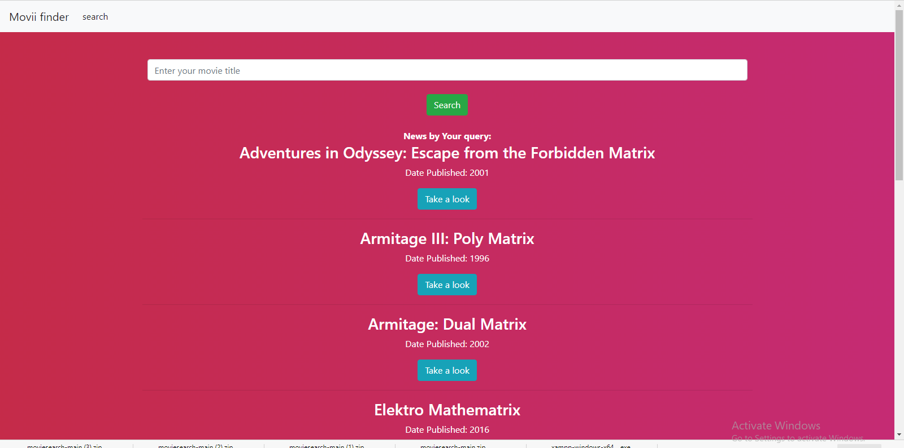

# Installation

#### ITS HIGHLY RECOMMENDED YOU WATCH THE TUTORIAL I MADE:

#### https://youtu.be/nmO7RWHqrp4

#### IT SHOWS ACTIVE AND LIVE EXAMPLES OF INSTALLATION AND THE SITE RUNNING!

## MANUAL STEPS

1. firstly we need to have a program called XAMPP installed you can find a link to that download here:
   https://www.apachefriends.org/download.html
   XAMPP is basically a mini PHP server run on your local host.

2. once you complete the installation process of this program, you're going to want to check and make sure everything is working properly.
   proceed to open "XAMPP Control Panel" then click "Start" on the "Apache" and "MySQL" module options displayed.
   
3. now of course we need the files to work on the server, so download or clone this repository to "htdocs" folder found in the "xampp" directory. if you didn't set a specific        location for XAMPP to be installed, you can find xampp folders in your default drive ( on most windows computers that would be:  C:\xampp\htdocs  ).

4. navigate into htdocs folder and the "moviesearch-main" folder can be found there, and if there is a folder within that folder also called "moviesearch-main" remove it from the parent folder and move it to "htdocs" folder. rename the folder to "moviesearch" and remove the empty parent folder.

5. in "htdocs" move the "moviedb" folder to the mysql data directory folder at xampp\mysql\data 
   (default location C:\xampp\mysql\data) 
   
5. now open your web browser of choice either type in localhost/moviesearch/index.php or just click here http://localhost/moviesearch/index.php (make sure you have XAMPP running      with the Apache and mySQL modules running)

Should get a page that looks like this without the results!

if you have any questions please send me a email at thomas.ja.shetler@gmail.com
